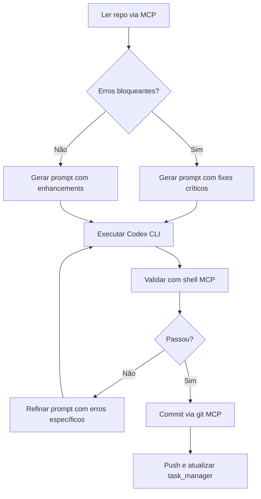

# **Contrato: Método Codex CLI + MCP Inteligente**

<!-- Destaque: Este documento é a referência oficial do método -->

## **Visão Geral**
- O objetivo deste **Contrato** é padronizar o uso do **Codex CLI** com **MCPs (Multi-Context Providers)**, priorizando **diagnóstico antes da automação**, execução **reprodutível** e **validação verificável**.
- O público-alvo são equipes técnicas brasileiras que buscam **clareza operacional**, **consistência de terminologia** e **entregas auditáveis**.

## **Princípios Fundamentais**

### **1. Diagnóstico Primeiro, Automação Depois**
- **Sempre** ler o repositório via MCPs relevantes (**github**, **filesystem**) antes de gerar prompts.
- Identificar erros com **linha/arquivo/código exato** (imports ausentes, conflitos, duplicatas).
- Mapear MCPs disponíveis e selecionar os **mais adequados** para cada subtarefa.

### **2. Prompt Específico e Executável**
- Prompts devem ser **estruturados**, **não ambíguos** e conter **ações verificáveis**.
- Evite pedidos genéricos; **seja preciso** sobre arquivos, trechos e comandos.

## **Template de Prompt para Codex CLI**
<!-- Destaque: Use este template como base para todos os prompts -->

```markdown
[TÍTULO CLARO DO OBJETIVO]

## Critical Fixes (lista priorizada de bloqueios)
1. [Erro específico com linha/arquivo/código exato]
2. [Próximo erro crítico com referência precisa]

## Enhancements (melhorias não-bloqueantes)
- [Feature/doc/refactor com contexto completo]

## [SEÇÃO ESPECÍFICA] (ex: AGENTS.md, Deploy, CI/CD)
[Template/código/configuração completa — **nunca** deixar "preencher depois"]

## Validation Steps
1. [Comando verificável: `make lint`, `make test`]
2. [Checagem de arquivo: `grep`/`cat` com caminho e padrão]
3. [Mensagem de commit padronizada]

## MCP Tool Usage Priority
- [nome_mcp]: [ação específica no arquivo X]
- [nome_mcp]: [comando git/github exato]

Execute todas as correções **atomicamente** e reporte o **status final**.
```

## **Hierarquia de MCPs por Tipo de Tarefa**
<!-- Destaque: Priorize MCPs conforme a natureza da tarefa -->

| Tarefa | MCP Primário | MCP Secundário | MCP Terciário |
|--------|--------------|----------------|---------------|
| **Leitura de repo** | `github` (get_file_contents) | `filesystem` (read_file) | `git` (git_show) |
| **Escrita de código** | `filesystem` (write_file) | `github` (create_or_update_file) | - |
| **Commits/Push** | `git` (git_commit, git_push) | `github` (push_files) | - |
| **PRs/Issues** | `github` (create_pull_request) | `task_manager` (update_task) | - |
| **Validação** | `shell` (shell_exec `make lint`) | `playwright` (E2E tests) | - |
| **Docs/Busca** | `brave_search` | `exa_search` | `context7` (library docs) |
| **Tracking** | `task_manager` | `memory` (add_observations) | - |

## **Regras de Ouro**

<!-- Destaque: Nunca -->
### **Nunca**
- Gerar prompts vagos (ex.: "corrigir erros", "melhorar docs").
- Deixar placeholders (`YOUR_TOKEN_HERE`, `TODO: preencher`).
- Ignorar erros de lint/test antes de prosseguir.
- Omitir MCPs no prompt.
- Usar `sed -i` em Windows/WSL sem validação (prefira comandos compatíveis com PowerShell).

<!-- Destaque: Sempre -->
### **Sempre**
- Incluir **linha/arquivo/código exato** do erro.
- Fornecer **template completo** (ex.: `docs/AGENTS.md`, `codecov.yml`).
- Listar **passos de validação executáveis**.
- Mapear **MCP por subtarefa**.
- Validar saída com `make lint` e `make test`.

## **Workflow Padrão**



## **Guia de Execução e Validação**

### **Passos de Execução**
- Ler e entender o repositório com MCPs (`github`, `filesystem`).
- Gerar prompt usando o **Template** acima com referências exatas.
- Executar o **Codex CLI** no modo **full-auto** para aplicar as correções.
- Validar com **lint** e **testes**.
- Versionar com commit **conventional** e realizar **push**.

### **Comandos de Validação (exemplos)**
- Lint e testes:
```bash
make lint && make test
```
- Conferir arquivos específicos:
```bash
grep -n "^#" docs/AGENTS.md | head -n 5
```
- Status de versão:
```bash
git status && git log -n 3 --oneline
```

## **Template de Memória (para este chat)**
<!-- Destaque: Usar como checklist de execução -->

```yaml
codex_cli_workflow:
  step_1_diagnostico:
    - usar: github.get_file_contents para ler ci.yml, main.py, auth.py
    - verificar: lint errors via filesystem.read_file(logs/)
    - listar: MCPs disponíveis (/mcp no Codex)

  step_2_prompt_generation:
    - formato: Critical Fixes → Enhancements → Templates → Validation → MCP Usage
    - incluir: linhas exatas, código completo, sem placeholders
    - mapear: cada tarefa a um MCP específico

  step_3_execution:
    - rodar: codex -m <modelo> -c model_reasoning_effort="high" --full-auto "[prompt]"
    - aguardar: execução automática com MCPs
    - capturar: saídas e erros para refinamento

  step_4_validation:
    - executar: shell.shell_exec("make lint && make test")
    - verificar: filesystem.read_file(docs/AGENTS.md) tem 4 seções
    - confirmar: git.git_status limpo

  step_5_commit:
    - usar: git.git_commit com mensagem conventional
    - push: git.git_push origin branch
    - atualizar: task_manager.mark_task_done

  step_6_tracking:
    - memory.add_observations: "Codex CLI completou X com MCPs Y,Z"
    - task_manager.update_task: status=done, completedDetails: [resumo]

mcp_priority_map:
  leitura: [github, filesystem, git]
  escrita: [filesystem, github]
  versionamento: [git, github]
  automacao: [shell, playwright, task_manager]
  pesquisa: [brave_search, exa_search, context7]
  memoria: [memory, task_manager]

regras_contrato:
  - diagnostico_antes_automacao: true
  - prompt_especifico_com_linhas: true
  - templates_completos_sem_placeholders: true
  - validacao_obrigatoria: [lint, test]
  - mcp_mapeado_por_tarefa: true
  - workflow_atomico: true
```

## **Links Úteis**
- **Conventional Commits**: https://www.conventionalcommits.org/pt-br/v1.0.0/
- **GitHub Actions**: https://docs.github.com/actions
- **Ruff (Lint Python)**: https://docs.astral.sh/ruff/
- **Bandit (Security)**: https://bandit.readthedocs.io/
- **pip-audit**: https://pypi.org/project/pip-audit/
- **Playwright**: https://playwright.dev/

## **Revisão Final**
<!-- Destaque: usar antes de concluir qualquer entrega -->

### **Checklist dos Pontos Principais**
- Princípio aplicado: **Diagnóstico antes da automação**.
- Prompt com **linhas/arquivos exatos** e **validação verificável**.
- Workflow seguido: **leitura → execução → validação → commit/push**.
- Mensagem de commit em padrão **Conventional Commits**.
- MCPs mapeados e utilizados conforme a **tarefa**.

### **Dicas de Implementação**
- Mantenha prompts **curtos e objetivos**, com referências precisas.
- Prefira **comandos reprodutíveis** e **não interativos**.
- Documente decisões em arquivos de **doc** próximos ao código alterado.
- Para Windows, use comandos compatíveis com **PowerShell** quando necessário.

### **Erros Comuns e Como Evitá-los**
- Prompts vagos ou sem referências exatas → use o **Template de Prompt** e cite linhas.
- Pular validação (lint/test) → implemente **Validation Steps** sempre.
- Alterações parciais → faça correções **atômicas** e valide antes do push.
- Esquecer mapeamento de MCPs → preencha a seção **MCP Tool Usage Priority**.
- Comandos incompatíveis com o ambiente → valide em **Windows/PowerShell** quando aplicável.

<!-- Fim do documento: mantenha este contrato visível para todo o time -->
